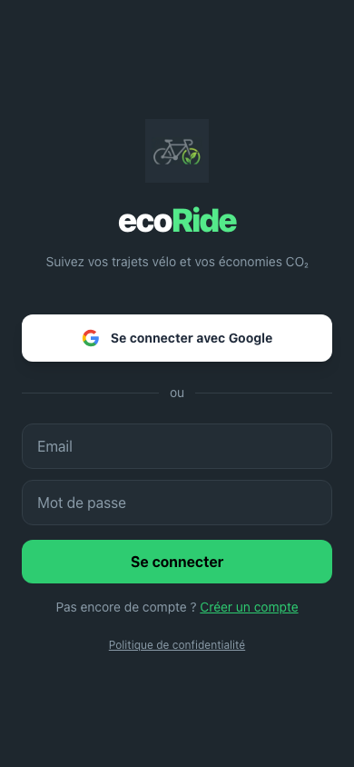
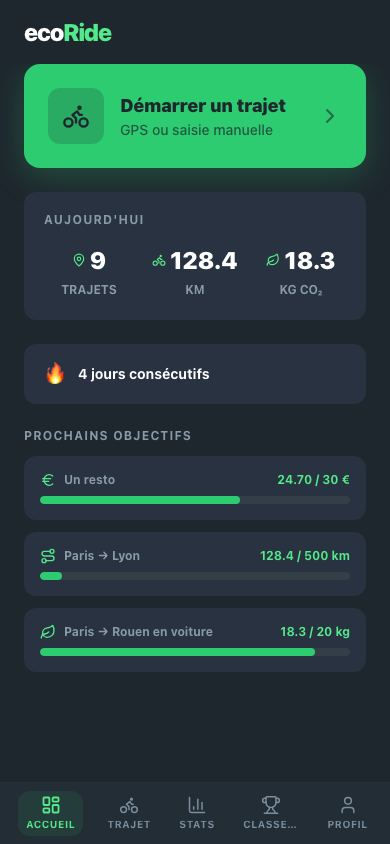
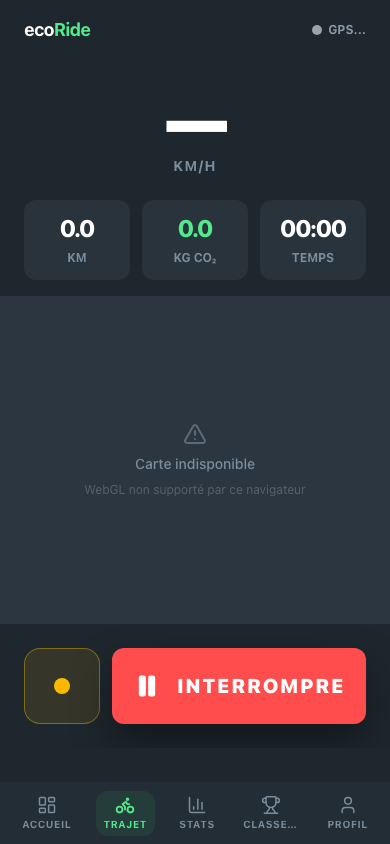
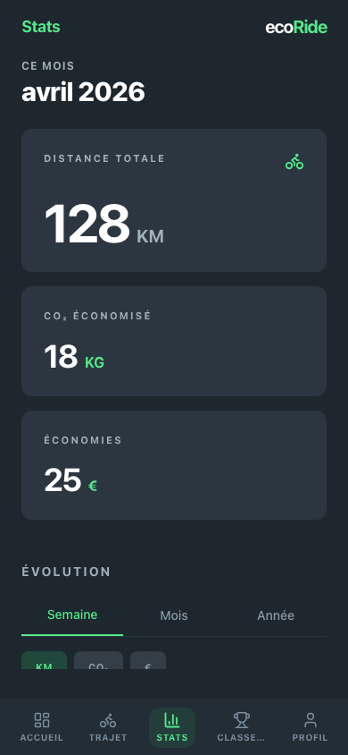
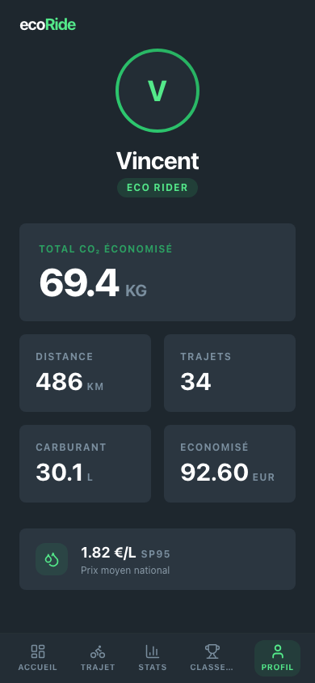

# ecoRide

PWA mobile-first de suivi de trajets vélo avec calcul d'économies CO₂, argent et essence.

## Aperçu

<p align="center">
  
  
  
  
  
</p>

## Fonctionnalités

- **GPS tracking** : watchPosition haute précision, haversine, wake lock, indicateur qualité GPS
- **Saisie manuelle** : distance + durée optionnelle pour les trajets sans GPS
- **Calculs** : CO₂ économisé (facteur ADEME 2.31 kg/L), argent, carburant
- **Prix carburant** : API officielle data.economie.gouv.fr, géolocalisé si GPS disponible
- **Gamification** : 12 badges avec unlock/revocation automatique, streaks
- **Classement** : leaderboard multi-utilisateur avec dense ranking et opt-out
- **Notifications push** : badges débloqués, dépassements au classement, rappels quotidiens
- **Offline** : file d'attente localStorage avec sync automatique au retour réseau
- **PWA** : installable, auto-update avec version polling toutes les 5 min
- **RGPD** : export de données, suppression de compte, politique de confidentialité

## Stack

- **Frontend** : React 19 + Vite + TailwindCSS v4 + PWA + Playwright
- **Backend** : Bun + Hono + Drizzle ORM
- **Auth** : Better Auth (Google OAuth + email/password)
- **DB** : PostgreSQL
- **CI** : GitHub Actions (typecheck + vitest + Playwright smoke tests)
- **Deploy** : Docker + auto-bump + Coolify

## Setup

```bash
# Prérequis : Bun, Docker

# 1. Installer les dépendances
bun install

# 2. Copier les variables d'environnement
cp .env.example .env
# → Remplir GOOGLE_CLIENT_ID, GOOGLE_CLIENT_SECRET, BETTER_AUTH_SECRET

# 3. Lancer PostgreSQL
docker compose up -d

# 4. Pousser le schéma DB
bun run db:push

# 5. Lancer le dev
bun run dev
```

Le client tourne sur http://localhost:5173, le serveur sur http://localhost:3000.

## Structure

```
shared/     Types TypeScript partagés + contrats API
server/     API Hono + Drizzle schema + Better Auth
client/     React PWA + Tailwind + Playwright e2e
```

## Scripts

| Commande | Description |
|----------|-------------|
| `bun run dev` | Lance client + serveur en parallèle |
| `bun run dev:client` | Client seul (Vite :5173) |
| `bun run dev:server` | Serveur seul (Hono :3000) |
| `bun run db:push` | Applique le schéma Drizzle sur la DB |
| `bun run db:generate` | Génère une migration Drizzle |
| `bun run db:studio` | Ouvre Drizzle Studio |
| `bun run typecheck` | Vérifie les types dans tous les workspaces |
| `cd client && bunx vitest run` | Lance les tests unitaires |
| `cd client && npx playwright test` | Lance les smoke tests e2e |

## CI / CD

### Pipeline CI (sur chaque PR)

1. **TypeScript check** : `bun run typecheck`
2. **Tests unitaires** : `bunx vitest run` (badges, calculs, haversine, streaks, fuel price, push)
3. **Smoke tests Playwright** : build client + test chaque page sans crash

### Pipeline CD (sur merge dans main)

1. **Auto-bump** : lit le conventional commit (`feat:` → minor, `fix:` → patch)
2. **Deploy** : trigger Coolify après le bump
3. **Auto-update PWA** : l'app poll `/api/health` toutes les 5 min, purge le cache si version changée

## Deploiement

### Docker

```bash
# Build et lancer tous les services
docker compose up --build

# L'app est accessible sur http://localhost:3000
```

### Variables d'environnement (production)

| Variable | Description |
|----------|-------------|
| `DATABASE_URL` | Connexion PostgreSQL |
| `BETTER_AUTH_SECRET` | Secret auth (`openssl rand -hex 32`) |
| `BETTER_AUTH_URL` | URL publique de l'app (ex: `https://mon-domaine.com`) |
| `GOOGLE_CLIENT_ID` | Client ID Google OAuth |
| `GOOGLE_CLIENT_SECRET` | Client Secret Google OAuth |
| `FRONTEND_URL` | URL publique de l'app (même valeur que `BETTER_AUTH_URL`) |
| `VAPID_PUBLIC_KEY` | Clé publique push (`bunx web-push generate-vapid-keys`) |
| `VAPID_PRIVATE_KEY` | Clé privée push |
| `VAPID_SUBJECT` | `mailto:votre-email@exemple.com` |
